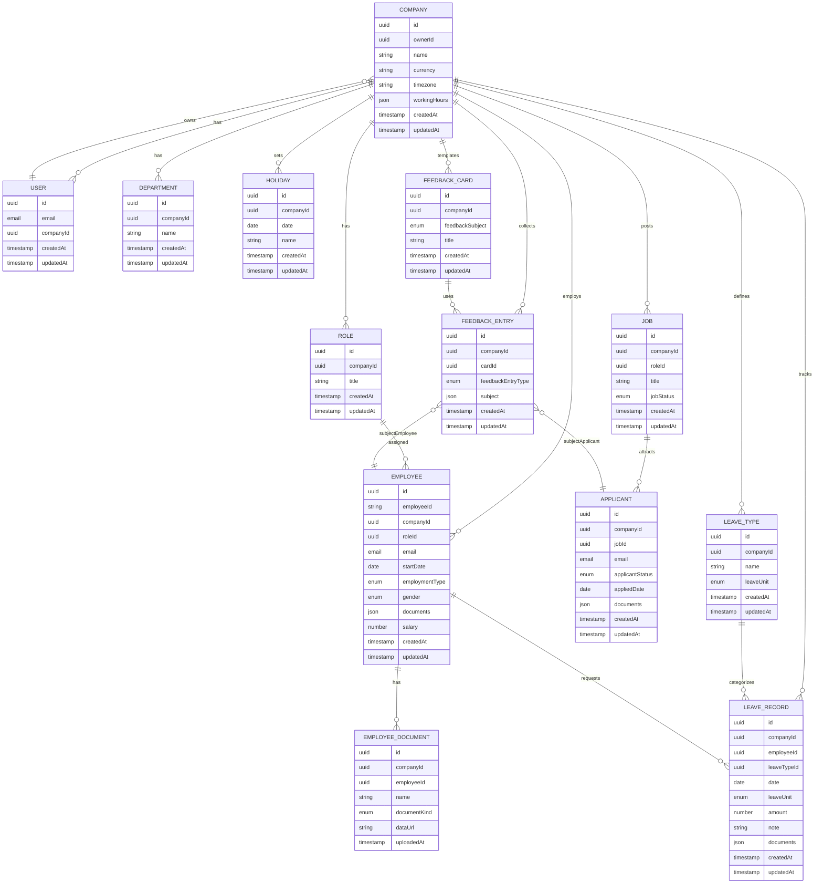

# ER Diagram (Mermaid)

```mermaid
erDiagram
    COMPANY ||--o{ USER : has
    USER ||--o{ COMPANY : owns

    COMPANY ||--o{ EMPLOYEE : employs
    ROLE ||--o{ EMPLOYEE : assigned
    EMPLOYEE ||--o{ EMPLOYEE_DOCUMENT : has

    COMPANY ||--o{ DEPARTMENT : has
    COMPANY ||--o{ ROLE : has
    COMPANY ||--o{ JOB : posts
    JOB ||--o{ APPLICANT : attracts

    COMPANY ||--o{ LEAVE_TYPE : defines
    COMPANY ||--o{ LEAVE_RECORD : tracks
    LEAVE_TYPE ||--o{ LEAVE_RECORD : categorizes
    EMPLOYEE ||--o{ LEAVE_RECORD : requests

    COMPANY ||--o{ HOLIDAY : sets
    COMPANY ||--o{ FEEDBACK_CARD : templates
    COMPANY ||--o{ FEEDBACK_ENTRY : collects
    FEEDBACK_CARD ||--o{ FEEDBACK_ENTRY : uses
    FEEDBACK_ENTRY }o--|| EMPLOYEE : subjectEmployee
    FEEDBACK_ENTRY }o--|| APPLICANT : subjectApplicant

    COMPANY {
        uuid id
        uuid ownerId
        string name
        string currency
        string timezone
        json workingHours
        timestamp createdAt
        timestamp updatedAt
    }

    USER {
        uuid id
        email email
        uuid companyId
        timestamp createdAt
        timestamp updatedAt
    }

    EMPLOYEE {
        uuid id
        string employeeId
        uuid companyId
        uuid roleId
        email email
        date startDate
        enum employmentType
        enum gender
        json documents
        number salary
        timestamp createdAt
        timestamp updatedAt
    }

    EMPLOYEE_DOCUMENT {
        uuid id
        uuid companyId
        uuid employeeId
        string name
        enum documentKind
        string dataUrl
        timestamp uploadedAt
    }

    DEPARTMENT {
        uuid id
        uuid companyId
        string name
        timestamp createdAt
        timestamp updatedAt
    }

    ROLE {
        uuid id
        uuid companyId
        string title
        timestamp createdAt
        timestamp updatedAt
    }

    JOB {
        uuid id
        uuid companyId
        uuid roleId
        string title
        enum jobStatus
        timestamp createdAt
        timestamp updatedAt
    }

    APPLICANT {
        uuid id
        uuid companyId
        uuid jobId
        email email
        enum applicantStatus
        date appliedDate
        json documents
        timestamp createdAt
        timestamp updatedAt
    }

    LEAVE_TYPE {
        uuid id
        uuid companyId
        string name
        enum leaveUnit
        timestamp createdAt
        timestamp updatedAt
    }

    LEAVE_RECORD {
        uuid id
        uuid companyId
        uuid employeeId
        uuid leaveTypeId
        date date
        enum leaveUnit
        number amount
        string note
        json documents
        timestamp createdAt
        timestamp updatedAt
    }

    HOLIDAY {
        uuid id
        uuid companyId
        date date
        string name
        timestamp createdAt
        timestamp updatedAt
    }

    FEEDBACK_CARD {
        uuid id
        uuid companyId
        enum feedbackSubject
        string title
        timestamp createdAt
        timestamp updatedAt
    }

    FEEDBACK_ENTRY {
        uuid id
        uuid companyId
        uuid cardId
        enum feedbackEntryType
        json subject
        timestamp createdAt
        timestamp updatedAt
    }
```
